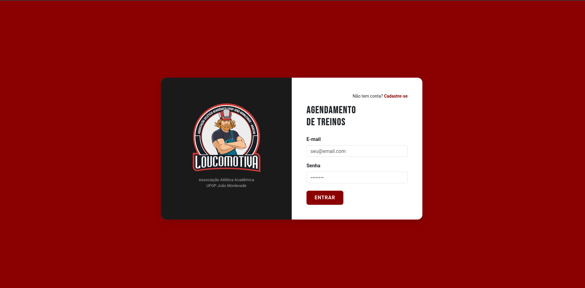
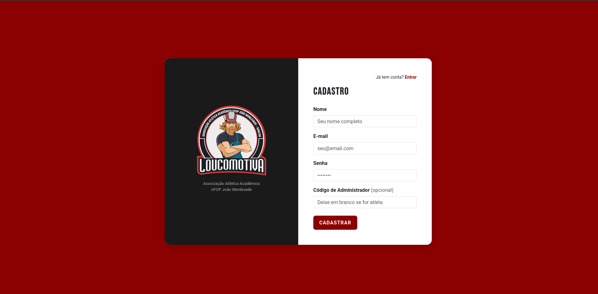
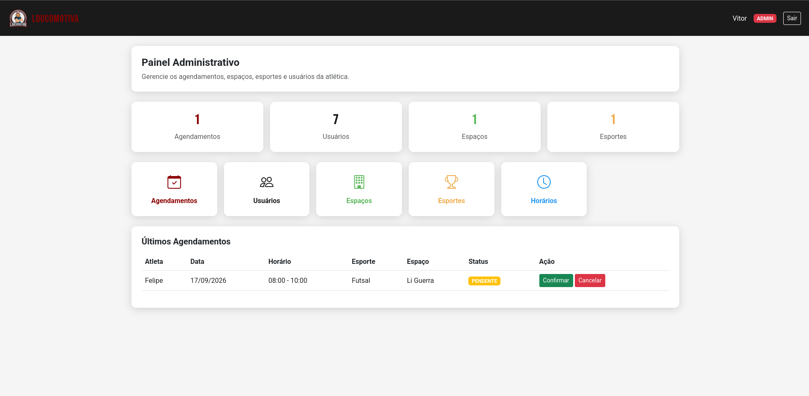
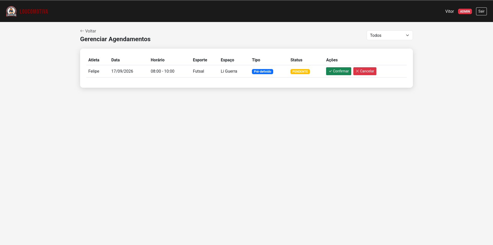

# CSI477-2026-01 - Remoto - Proposta de Trabalho Final

**Discente:** Rany Souza Melo - 23.1.8065

---

## Resumo

Este trabalho propõe o desenvolvimento de um sistema web de agendamento de horários de treinos para a Atlética Loucomotiva (UFOP JM). O sistema permitirá que atletas e membros realizem reservas de espaços esportivos de forma prática e organizada, eliminando conflitos de horários e centralizando o controle dos recursos disponíveis. A plataforma contará com perfis distintos para atletas e administradores, possibilitando uma gestão eficiente das quadras, modalidades e agendamentos da atlética.

---

## 1. Tema

O trabalho final tem como tema o desenvolvimento de um sistema web de agendamento de horários de treinos para a Atlética Loucomotiva (UFOP JM). O sistema visa substituir o controle manual e informal atualmente utilizado, oferecendo uma plataforma centralizada para reserva e gerenciamento de espaços esportivos.

---

## 2. Escopo

Este projeto terá as seguintes funcionalidades:

- **Autenticação de usuários:** cadastro e login com perfis distintos para atletas e administradores;
- **Gerenciamento de espaços esportivos:** cadastro, edição e remoção de quadras e locais de treino;
- **Gerenciamento de modalidades:** cadastro e controle dos esportes disponíveis na atlética;
- **Agendamento de horários:** reserva de espaços esportivos por data, horário e modalidade, com controle de disponibilidade e capacidade máxima;
- **Agenda semanal:** visualização dos horários reservados na semana;
- **Painel administrativo:** gerenciamento de agendamentos, usuários e espaços pelo administrador;
- **Histórico de reservas:** consulta de agendamentos anteriores e seus respectivos status;
- **Gerenciamento de perfil:** visualização e edição dos dados pessoais do usuário.

---

## 3. Restrições

Neste trabalho não serão considerados:

- Desenvolvimento de aplicativo mobile — o sistema será disponibilizado exclusivamente como aplicação web;
- Envio de notificações por e-mail ou SMS;
- Integração com sistemas de pagamento;
- Integração com sistemas externos ou APIs de terceiros;
- Suporte a múltiplas atleticas — o sistema será desenvolvido exclusivamente para a Atlética Loucomotiva (UFOP JM).

---

## 4. Protótipo

Protótipos para as páginas de Login, Dashboard, Agendamento, Agenda Semanal, Gerenciamento de Espaços, Gerenciamento de Usuários, Histórico de Reservas e Perfil do Usuário serão elaborados e poderão ser encontrados neste repositório ao longo do desenvolvimento do projeto.

### Login

### Cadastro

### Dashboard Administrativo

### Gerenciamento de Agendamentos

---

## 5. Referências

JOHNSON, Rod; HOELLER, Juergen. *Spring Framework Reference Documentation*. Disponível em: https://docs.spring.io/spring-framework/reference/. Acesso em: maio 2026.
